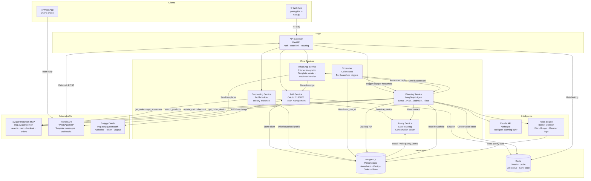
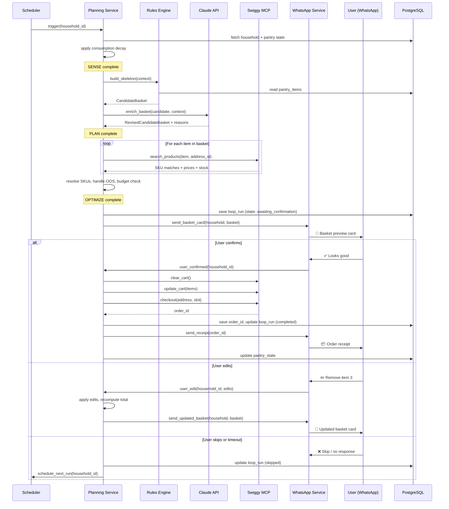
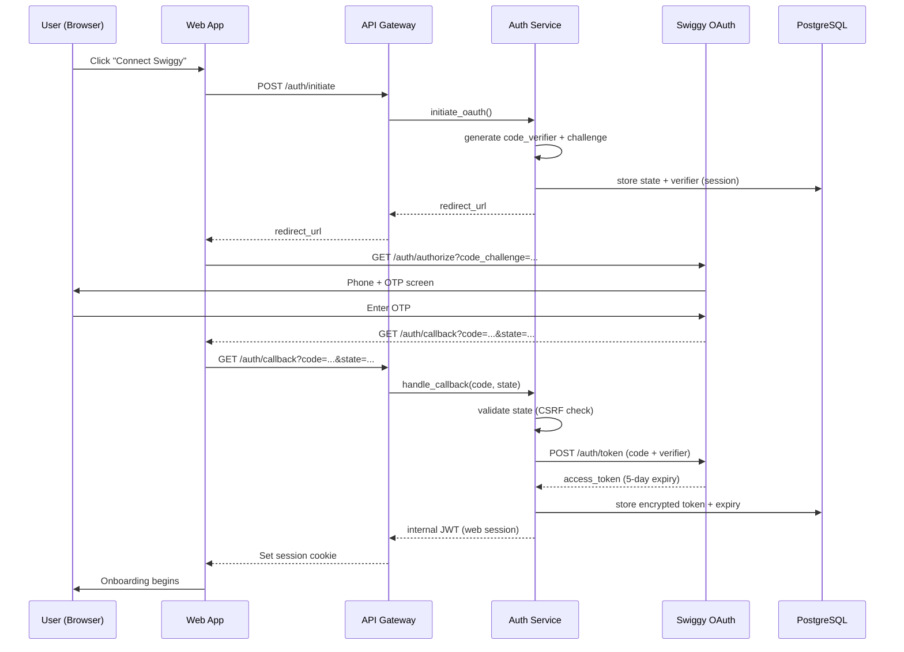

# PantryPilot — High-Level Design
*Last updated: 2026-06-26*

---

## System Overview

PantryPilot is a backend-heavy system. The intelligence lives server-side. Clients (web app and WhatsApp) are thin — they collect input and deliver output. The core of the system is the planning loop, which runs autonomously on a schedule.

---

## Architecture Diagram



---

## Component Breakdown

### 1. Web App (Client)
**Tech:** Next.js (React)
**Responsibility:** Onboarding only. Users never return here after setup except for re-auth.

Pages:
- `/` — Landing page + "Connect Swiggy" CTA
- `/auth/callback` — OAuth redirect handler
- `/onboard` — 3-step questionnaire + inference summary + first basket preview
- `/reauth` — Re-authentication page (triggered from WhatsApp link)
- `/settings` — Minimal settings: change budget, delivery day, WhatsApp number, pause/delete

**Key principle:** No grocery data displayed here. The web app is a setup and settings surface — not a dashboard.

---

### 2. API Gateway
**Tech:** FastAPI (Python)
**Responsibility:** Single entry point for all requests. Handles auth middleware, rate limiting, request routing.

Responsibilities:
- JWT validation for web app requests
- Webhook signature validation for Interakt inbound messages
- Rate limiting per household (Redis-backed)
- Routes requests to appropriate downstream service
- Structured request/response logging

---

### 3. Auth Service
**Tech:** Python module within FastAPI
**Responsibility:** Owns the Swiggy OAuth 2.1 + PKCE flow end-to-end.

- Generates `code_verifier` + `code_challenge`
- Handles `/auth/callback` redirect
- Exchanges auth code for access token
- Stores encrypted token in Postgres
- Monitors token expiry, triggers re-auth WhatsApp nudges
- Issues internal JWT for web app session

→ Full detail in [docs/auth.md](../docs/auth.md)

---

### 4. Onboarding Service
**Tech:** Python module within FastAPI
**Responsibility:** Processes new household sign-ups.

- Calls `get_orders` + `get_addresses` via Swiggy MCP immediately after auth
- Runs inference pass (diet type, budget, brand preferences, order day)
- Stores household profile in Postgres
- Bootstraps pantry state (delegates to Pantry Service)
- Verifies WhatsApp number via OTP (delegates to WhatsApp Service)
- Generates first basket preview (delegates to Planning Service — dry run)

→ Full detail in [docs/onboarding.md](../docs/onboarding.md)

---

### 5. Planning Service ⭐
**Tech:** LangGraph (Python) + Claude API
**Responsibility:** The core of PantryPilot. Orchestrates the full Sense → Plan → Optimize → Confirm → Place loop.

Sub-components:
- **LangGraph agent** — orchestrates stage transitions, manages state machine
- **Rules Engine** — deterministic basket skeleton (diet filter, reorder logic, budget guard)
- **LLM layer** — Claude for gap-filling, variety, seasonal awareness
- **MCP Client** — wrapper around Swiggy Instamart MCP tools
- **Loop state tracker** — writes loop run state to Postgres at each stage

Triggered by:
- Scheduler (weekly, per household)
- Onboarding Service (first basket preview — dry run, no placement)
- WhatsApp Service (user replies "order now" outside schedule)

→ Full detail in [docs/planning-loop.md](../docs/planning-loop.md)

---

### 6. Pantry Service
**Tech:** Python module
**Responsibility:** Owns pantry state for all households.

- Bootstrap from order history (called by Onboarding Service)
- Apply consumption decay (called by Planning Service at SENSE stage)
- Update post-order (called by Planning Service after successful `checkout`)
- Learn consumption rates from user edit behaviour

→ Full detail in [docs/pantry-state.md](../docs/pantry-state.md)

---

### 7. WhatsApp Service
**Tech:** Python module + Interakt API client
**Responsibility:** All WhatsApp communication — outbound and inbound.

Outbound:
- Send basket preview card (Template 2)
- Send order receipt (Template 3)
- Send re-auth reminders (Templates 4, 5, 6)
- Send OTP for number verification (Template 1)

Inbound (webhook handler):
- Parse user reply (button tap or free text)
- Route to Planning Service (confirm / edit / skip)
- Route to Auth Service (re-auth link tapped)
- Handle opt-out ("STOP")
- Manage conversation state in Redis (track which household is mid-edit)

→ Full detail in [docs/whatsapp-integration.md](../docs/whatsapp-integration.md)

---

### 8. Scheduler
**Tech:** Celery Beat (Python)
**Responsibility:** Time-based trigger for planning loops.

- Reads `next_run_at` per household from Postgres
- Fires planning loop task via Celery worker
- Re-schedules `next_run_at` after each run (weekly + same time)
- Fires token expiry checks daily (48hr + 24hr nudges)
- Handles missed runs (if system was down at scheduled time — catch-up logic)

---

### 9. Rules Engine
**Tech:** Pure Python (no ML)
**Responsibility:** Deterministic basket skeleton. Fast, transparent, debuggable.

Rules applied in order:
1. Reorder items below threshold
2. Apply diet + allergy hard filters
3. Budget guard
4. Frequency guard (don't double-order recent items)
5. Minimum basket size check

---

### 10. Claude API (LLM)
**Tech:** Anthropic Claude (Sonnet for V1)
**Responsibility:** Intelligent layer on top of the rules engine basket.

- Gap-filling (missing categories)
- Variety suggestions (same items 4+ weeks in a row)
- Seasonal produce awareness
- Brand preference application
- Substitution reasoning (out-of-stock items)

Called once per planning loop, after Rules Engine. Prompt includes `CandidateBasket` + `HouseholdContext`. Returns structured JSON with reasons for every change.

---

## Data Flow: Weekly Planning Loop



---

## Data Flow: Authentication



---

## Infrastructure Diagram

```mermaid
graph TB
    subgraph Internet
        USER[👤 User]
        SWIGGY_API[Swiggy MCP API]
        INTERAKT_API[Interakt API]
        CLAUDE_API[Anthropic Claude API]
    end

    subgraph AWS ap-south-1
        subgraph VPC
            subgraph Public Subnet
                ALB[Application Load Balancer<br/>HTTPS termination]
                NAT[NAT Gateway<br/>Static egress IP<br/>Whitelisted by Swiggy]
            end

            subgraph Private Subnet — App Tier
                WEB_SVC[Web App Service<br/>Next.js · ECS Fargate]
                API_SVC[API Gateway Service<br/>FastAPI · ECS Fargate]
                WORKER[Celery Worker<br/>Planning + jobs · ECS Fargate]
                BEAT[Celery Beat<br/>Scheduler · ECS Fargate]
            end

            subgraph Private Subnet — Data Tier
                RDS[(RDS PostgreSQL<br/>Multi-AZ · Encrypted)]
                ELASTICACHE[(ElastiCache Redis<br/>Session · Queue · Conv state)]
            end
        end

        SM[AWS Secrets Manager<br/>Tokens · API keys]
        CW[CloudWatch<br/>Logs · Metrics · Alerts]
        S3[S3<br/>Log archive · Backups]
    end

    USER -->|HTTPS| ALB
    ALB --> WEB_SVC
    ALB --> API_SVC
    INTERAKT_API -->|Webhook HTTPS| ALB

    API_SVC --> RDS
    API_SVC --> ELASTICACHE
    WORKER --> RDS
    WORKER --> ELASTICACHE
    BEAT --> RDS

    WORKER -->|Via NAT| SWIGGY_API
    WORKER -->|Via NAT| CLAUDE_API
    API_SVC -->|Via NAT| INTERAKT_API

    API_SVC --> SM
    WORKER --> SM

    API_SVC --> CW
    WORKER --> CW
    WEB_SVC --> CW
    CW --> S3
```

---

## Key Architectural Decisions

### Why FastAPI over Django/Flask?
- Native async support — critical for concurrent MCP calls and LangGraph
- Automatic OpenAPI docs — useful for internal API contracts
- LangGraph integrates cleanly with Python async patterns

### Why LangGraph over raw Claude API calls?
- Built-in state machine management — maps cleanly to our Sense → Plan → Optimize loop
- Handles retries, interrupts, and human-in-the-loop (user confirmation) natively
- Checkpointing — loop state survives restarts
- Easy to add new loop stages without restructuring

### Why Celery + Beat over cron?
- Per-household scheduling (different day/time per household)
- Distributed — workers scale independently of the scheduler
- Built-in retry logic for failed tasks
- Redis as broker — already in the stack

### Why ECS Fargate over EC2?
- No server management for a solo builder
- Scale to zero when no loops are running (cost-efficient for closed beta)
- Separate services per component — deploy independently

### Why separate Rules Engine from LLM?
- Transparency: every basket item has a traceable reason (rule or LLM decision)
- Cost: rules handle the predictable 80%, LLM handles only the intelligent 20%
- Debuggability: when a basket is wrong, we know exactly which layer caused it
- Speed: rules run in milliseconds, LLM adds ~2–3 seconds — minimise LLM surface

---

## Security Boundaries

```
Internet → ALB (TLS termination)
ALB → App tier (internal VPC traffic only)
App tier → Data tier (private subnet, no public access)
App tier → External APIs (via NAT gateway with static IP — whitelisted by Swiggy)
Secrets → AWS Secrets Manager (never in env vars or code)
Swiggy tokens → Encrypted at rest in RDS (AES-256)
Interakt webhooks → Signature validated at API Gateway before processing
```

---

## What's Not in This Diagram (V2+)

- Nutrition engine service (NFI scoring, ICMR-NIN RDA computation)
- Confidence Score service (trust gating, auto-confirm)
- Recipe DB + ingredient-SKU mapping service
- Multi-platform MCP adapter (Zepto, BigBasket)
- Admin dashboard (internal monitoring for closed beta)
